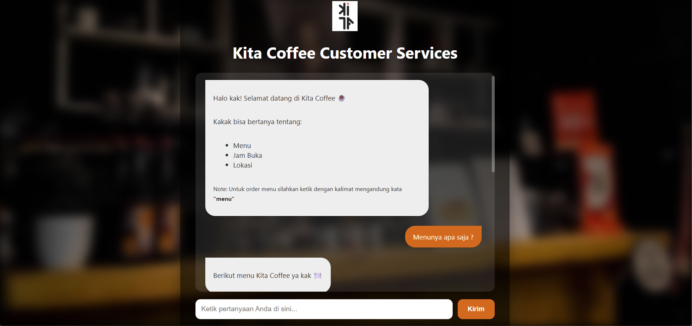
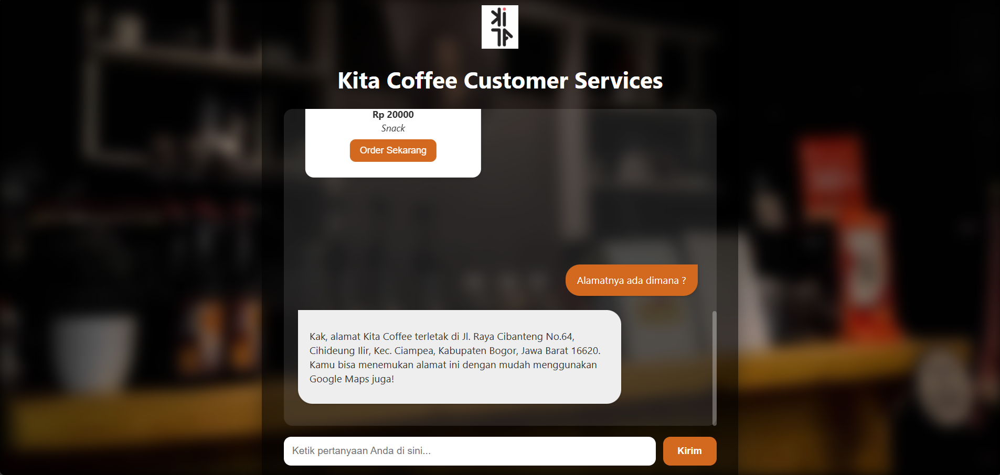

# Kita Coffee AI Chatbot

Kita Coffee AI Chatbot is an AI-powered customer service system designed to assist customers by answering questions and handling orders through natural conversation. The chatbot leverages a Large Language Model (LLM) combined with Retrieval-Augmented Generation (RAG) to deliver accurate, context-aware responses based on real-time data stored in a MySQL database.

This project aims to simulate a modern AI-driven café assistant that improves customer experience by providing fast, interactive, and human-like responses while maintaining factual accuracy.

---

## Overview

The chatbot integrates multiple AI and data components into a unified system. It uses Ollama’s LLaMA model for generating responses and enhances its accuracy through a RAG pipeline that retrieves relevant information from an internal knowledge base.

The system is capable of understanding user intent, matching menu items intelligently, and guiding users through a structured ordering process. It is built with a simple web interface using Flask, making it easy to test and deploy.

---

## Key Features

- **AI-powered chatbot**
  - Uses Ollama with LLaMA 3.2 model
  - Generates natural and conversational responses in Indonesian

- **Retrieval-Augmented Generation (RAG)**
  - Retrieves relevant context from ChromaDB
  - Ensures responses are based on real café data

- **Dynamic knowledge base**
  - Menu items (food & drinks)
  - Café information (location, contact)
  - Operational hours

- **Interactive order system**
  - Users can place orders directly via chat
  - Multi-step flow: item → name → address → quantity → confirmation

- **Smart matching system**
  - Fuzzy matching for menu search
  - Category alias handling (e.g., “kopi” → “coffee”)

- **Web-based interface**
  - Built using Flask and HTML
  - Displays menu items in card/carousel format

---

## Architecture

The system follows a modular architecture combining LLM and retrieval mechanisms:

- User sends a query through the web interface
- Flask API processes the request
- LangChain orchestrates prompt + model interaction
- Retriever fetches relevant context from ChromaDB
- Ollama (LLM) generates the final response
- MySQL serves as the primary data source

---

## Tech Stack

- **Backend**: Python (Flask)
- **LLM**: Ollama (LLaMA 3.2)
- **AI Framework**: LangChain
- **Embeddings**: HuggingFace (all-MiniLM-L6-v2)
- **Vector Database**: ChromaDB
- **Database**: MySQL
- **Frontend**: HTML, CSS

## Project Overview

## installation Instruction

- Clone the repository from GitHub  
- Navigate to the project directory  
- Open the project in VS Code  
- Create a virtual environment using:activate the virtual environment:
    - Windows: venv\Scripts\activate
    - Mac/Linux: source venv/bin/activate
- Install all dependencies
- Import Database file to DBMS
- Configure the database connection in your Python file (host, user, password, database)